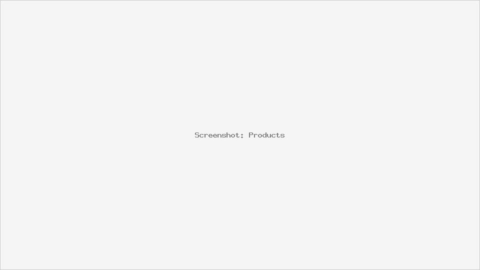
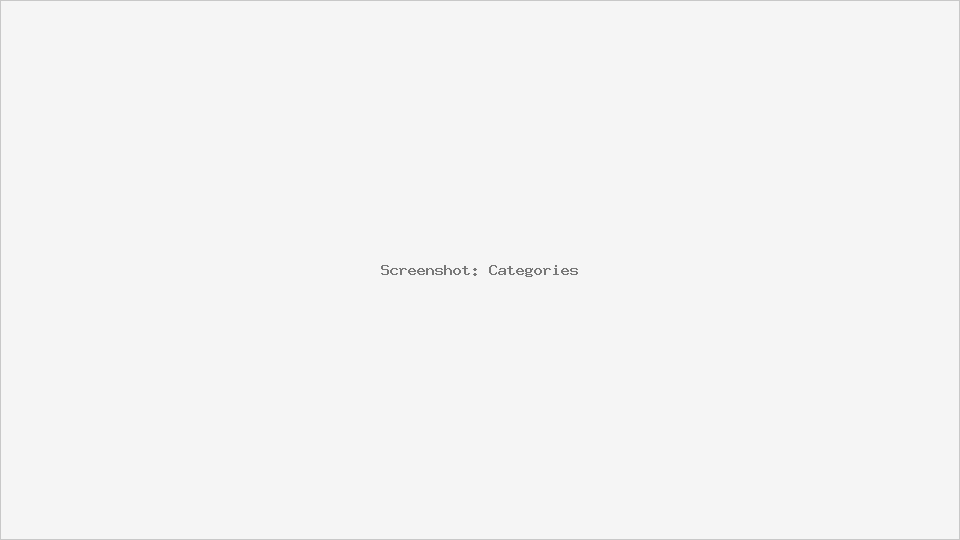

# Catalog Admin

Админ-панель управления каталогом товаров: Laravel 13 + Filament v5 + PostgreSQL.

## Стек

| Компонент | Версия |
|---|---|
| PHP | 8.4 |
| Laravel | 13 |
| Filament | 5 |
| PostgreSQL | 16 |
| spatie/laravel-permission | 8 |
| Pint / PHPUnit | — |

## Установка

### Docker (WSL2 + Docker Desktop)

```bash
# 1. Поднять базу (из каталога docker-compose.yml)
docker compose up -d

# 2. Зависимости
composer install

# 3. Конфигурация
cp .env.example .env
php artisan key:generate
# при необходимости поправить DB_HOST/DB_PORT/DB_USERNAME/DB_PASSWORD

# 4. Миграции и демо-данные
php artisan migrate --seed

# 5. Запуск
php artisan serve
```

Панель: `http://localhost:8000/admin`

### Демо-данные

Seeder создаёт:

- категории: Электроника (Смартфоны, Ноутбуки), Одежда (Обувь);
- 10 характеристик (Бренд, Цвет, ...);
- 20 товаров (SKU-0001…SKU-0020, с остатками и характеристиками);
- роли `admin` и `manager`;
- пользователя `test@example.com` (пароль `password`) с ролью `admin`.

## Архитектура

```
app/
├── DTO/            # ProductDTO, CategoryDTO, AttributeDTO
├── Filament/
│   └── Resources/  # Products/, Categories/, Attributes/
│                   #   Pages/ + Schemas/{Form} + Tables/{Table}
├── Models/         # Product, Category, Attribute, ProductAttribute, User
├── Policies/       # ProductPolicy, CategoryPolicy, AttributePolicy
├── Repositories/   # ProductRepository, CategoryRepository
└── Services/       # ProductService, CategoryService, AttributeService
```

### Слои

- **Models** — Eloquent, `#[Fillable]`-атрибуты, `@property`-докблоки.
- **DTO** — входные данные сервисов, `fromArray()`/`toArray()`.
- **Repositories** — доступ к данным: CRUD, фильтрация, дерево категорий
  (`getTree`, `getChildren`, `getDescendants`, `getAncestors`, `updateSortOrders`).
- **Services** — бизнес-логика и валидация:
  - `ProductService` — CRUD + синхронизация характеристик в `DB::transaction`;
  - `CategoryService` — CRUD, защита от циклов при переносе в собственную
    подкатегорию, запрет удаления категорий с подкатегориями или товарами;
  - `AttributeService` — CRUD, валидация (тип, уникальное имя,
    обязательные значения для `select`), запрет удаления используемых в товарах.
- **Policies** — правила доступа, применяются Filament автоматически
  (действия, страницы, bulk-операции).
- **Filament** — формы (`Schemas`), таблицы (`Tables`) и страницы
  (`Pages`) ресурсов, разделённые по классам.

### Роли

| Роль | Товары | Категории | Атрибуты |
|---|---|---|---|
| `admin` | все действия | все действия | все действия |
| `manager` | создание, просмотр, изменение | создание, просмотр, изменение | — |
| без роли | — | — | — |

`admin` — через `Gate::before` (полный доступ); доступ к панели ограничен
`FilamentUser::canAccessPanel()` — только пользователи с ролью `admin`/`manager`.

### Таблица товаров

- поиск по названию и SKU;
- фильтр по категории с учётом всех потомков (дерево с `<optgroup>`);
- динамические фильтры по атрибуту и его значению;
- сортировка по цене, остатку, дате создания;
- фильтр по активности.

## Тесты

```bash
php artisan test
```

- **Feature**: CRUD каждой сущности через сервисы, доступ по ролям
  (политики + HTTP-страницы + авторизация действий), поиск и фильтры таблицы;
- **Unit**: структура дерева категорий, валидация характеристик.

## Стиль кода

```bash
vendor/bin/pint
```

## Скриншоты

| Товары | Категории | Атрибуты |
|---|---|---|
|  |  |  |
